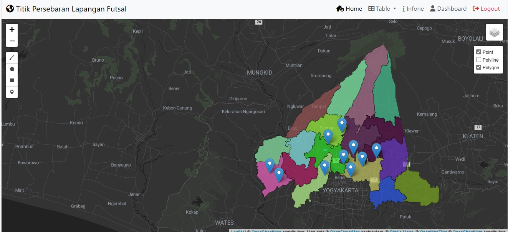

# WEBGIS Persebaran Tititk Lapangan Futsal

>Persebaran Tititk Lapangan Futsal

    Olahraga futsal merupakan olahraga yang sangat terkenal dan marak di dunia. Perkembangan olahraga futsal semakin pesat dengan adanya berbagai pembinaan usia dini. Terdapat beberapa faktor yang dapat mendorong keberlangsungan olahraga futsal, salah satunya adalah lapangan untuk latihan. Tempat latihan memiliki korelasi dengan perkembangan olahraga ini. Karena semakin banyak masyarakat yang bermain, semakin banyak tempat atau media yang dibutuhkan untuk melakukan permainan. Dengan semakin majunya era teknologi dan informasi, manusia dituntut semakin kritis untuk mencari lapangan futsal yang memiliki fasilitas memadai sekaligus memiliki suasana nyaman sehingga dapat membuat orang betah berada ditempat tersebut. Oleh karena itu persebaran lapangan futsal sangat diperlukan untuk membantu mendapatkan letak sekaligus referensi untuk memilih tempat yang akan digunakan..

>Komponen Pembangun

    Komponen yang ada yaitu  File GeoJSON, database DBeaver, Library LeafletJS, Bootstrap,dan Plugin pada muka Peta

>Manfaat & Tujuan

1. Memudahkan masyarakat untuk mencari dan menemukan lokasi lapangan futsal terdekat melalui akses web yang mudah dijangkau dari berbagai perangkat.
   
2.Membantu pihak pengelola atau pemerintah daerah dalam merencanakan dan mengelola fasilitas olahraga dengan lebih baik, berdasarkan data yang akurat tentang lokasi dan jumlah lapangan futsal.
   
3. Membantu dalam mempromosikan lapangan futsal kepada calon pengguna, sehingga dapat meningkatkan partisipasi masyarakat dalam olahraga futsal.

>Sumber Data
1. [Shapefile sleman]
2. [Titik Perseberan Lapangan Futsal]

>Screenshot Website
### Home Page
>
### Map Public
>
### Map Login
>
### Data
>

>Dikembangkan oleh [Yellove Devitaraja](https://github.com/Devitaraja/pgwl.git)

>Link Project https://github.com/Devitaraja/pgwl.git)